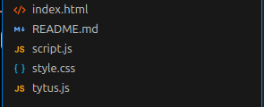
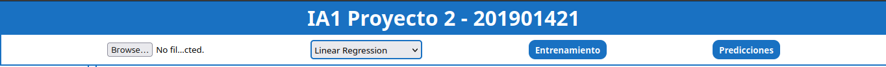

### **Universidad de San Carlos de Guatemala**
### **Facultad de Ingeniería**
### **Escuela de Ciencias y Sistemas**
### **Segundo Semestre 2024**  
### **Inteligencia Artificial 1**  

---  

### **Angel Miguel García Urizar**  
### **201901421**   

---  
  
**<h1 align="center">Proyecto 2 - Manual Técnico</h1>**  

### **Objetivo General**  
Poner en práctica los conceptos aprendidos de Machine Learning utilizando para ello la biblioteca de JavaScript `tytus.js`. Además, desarrollar una aplicación para implementar y utilizar los distintos modelos de Machine Learning que ofrece la biblioteca de tytus, ofreciendo la posibilidad de parametrizar los modelos para su entrenamiento y predicción. Para que la aplicción web este disponible para su uso se debe desplegar utilizando el servicio de Github Pages, que permite desplegar una aplicación web desde un repositorio de Github.  

### **Objetivos Específicos**     
1. Utilizar la biblioteca de JavaScript puro `tytus.js` para practicar conceptos de Machine Learning y utilizar diferentes modelos de Machine Learning por medio de una aplicación web.  
2. Desarrollar y desplegar una aplicación web con HTML, CSS Y JavaScript puro para utilizar la biblioteca de tytus y hacer uso de cada modelo que ofrece la biblioteca.  
3. Desarrollar la lógica necesaria para la parametrización de argumentos y datos necesarios para el uso y funcionamiento de cada modelo de Machine Learning a implementar en la página web.  
4. Mostrar por medio de gráficas si el modelo de Machine Learning lo permite, los resultados de las predicciones obtenidas al poner en funcinamiento alguno de los modelos de Machine Learning implementados.  
  
**<h3 align="center">Tecnologías utilizadas</h3>**     
  
### **tytus.js**  
La biblioteca de tytus.js está desarrollada con JavaScript puro y ofrece distintos modelos de Machine Learning. Cada uno de los modelos que ofrece requiere de un entrenamiento previo antes de su uso para predicciones. La biblioteca facilita el uso de los modelos al agrupar la lógica necesaria para el funcionaiento correcto de cada modelo, por lo que el desarrollador únicamente se debe encargar de la configuración de los parámetros específicos de cada modelo y también de proporcionar la data necesaria para entrenamiento y predicción de cada modelo. En total tytus.js ofrece 7 modelos de Machine Learning distintos, los modelos disponibles son:  
1. Linear Regression  
2. Polynomial Regression  
3. Decision Trees  
4. Naive Bayes  
5. Neuronal Networks  
6. K-means  
7. K-nearest Neighbor   

El código fuente de la biblioteca tytus.js y la documentación oficial de la aplicación están disponibles en el siguiente repositorio de Github:   

**Código fuente** 
```  
https://github.com/tytusdb/tytusjs/blob/main/dist/tytus.js    
```  
**Documentación oficial**  
```  
https://github.com/tytusdb/tytusjs  
```  
### **Chart.js**  
Chart.js es una biblioteca de JavaScript que permite la creación de gráficos interactivos para ser implementados en páginas web. Esta biblioteca se plantea como una solución simple, flexible y potente para la creación de gráficas. Sus características principales son:  

* **Simplicidad**: Chart.js es una biblioteca fácil de utilizar y la configuración para los diferentes tipos de gráficas tampoco es compleja.  
* **Flexibilidad**: La biblioteca ofrece una gran cantidad de opciones de personalización para las gráficas generadas.
* **Variedad de Tipos de Gráficos**: Soporta varios tipos de gráficos como barras, líneas, radar, donas, tortas, burbujas, dispersión, entre otros.  

La descarga de la biblioteca y su documentación oficial están disponibles en el siguiente enlace:  
```  
https://www.chartjs.org/  
```   

### **HTML, CSS y JavaScript**   
Se utilizó HTML para el maquetado y estructura de la página web, el diseño y estilo fue realizado con CSS, mientras que la lógica de la página web y el manejo de la biblioteca de `tytus.js` y `Chart.js` se desarrollo con el lenguaje JavaScript. Adiconalmente, la aplicación fue desplegada para sus uso utilizando el servicio de `Github Pages` proporcionado por Github.  

**<h3 align="center">Estructura del proyecto</h3>**  
La estructura utilizada para el proyecto es la siguiente:  
<p align="center">
  
</p>  

* **index.html**:  Este archivo contiene la estructura y el maquetado de la página web con la que se utilizan los modelos de Machine Learning.  
* **script.js**: Este archivo contiene la lógica necesaria para el funcionamiento de la aplicación, como lectura del achivo csv, instancias de los modelos de Machine Learning, generación de gráficas, entrenamiento de los modelos de ML y realización de prediccciones.  
* **style.css**: Este archivo contiene el CSS utilizado para el diseño de la página web del archivo index.html  
* **tytus.js**: Este archivo es la biblioteca de `tytus` contiene el código fuente y la lógica de cada modelo de Machine Learning.  

**<h3 align="center">Lógica del proyecto</h3>**  
La aplicación web consiste en selector que permite elegir entre diferentes modelos de Machine Learning para utlizar en el entrenamiento y en las predicciones. La data para entrenar a los modelos se obtiene de la carga de archivos `.csv` por parte del usuario. Luego de cargar la información del archivo, se debe entrenar al modelo presionando un botón y finalmente se realizan las predicciones, también se debe dar click en un botón para dicho proceso. Durante las predicciones también se generan gráficas con `Chart.js`.  

<p align="center">
  
</p>    

### **Lectura de archivo csv**  
La data para el entrenamiento de los modelos de Machine Learning se obtiene de archivos csv, la lógica en código JavaScript para leer el archivo es la siguiente:  
```javascript   
// Leer el archivo CSV
document.getElementById('filepicker').addEventListener('change', (e) => {
    const file = e.target.files[0];
    if (file) {
        const fr = new FileReader();
        fr.onload = function(event) {
            const content = event.target.result;
            const splitedContent = content.split('\n');
            splitedContent.pop();
            const model = document.getElementById('model').value;
            if (model === 'lr') {
                readLinearRegressionCSV(splitedContent);
            }else if(model === 'pr') {
                readPolynomialRegressionCSV(splitedContent);
            }
        };
        fr.readAsText(file);
    }
});  
```  

### **Selección del modelo**  
Lógica para el manejo de los modelos disponible y la visualización de la información correspondiente a cada modelo:  
```javascript  
document.getElementById('model').addEventListener('change', () => {
    const model = document.getElementById('model').value;
    if (model === 'lr') {
        lr = new LinearRegression();
        document.getElementById('lr-parameters').style.display = 'flex';
        document.getElementById('lr-result').style.display = 'flex';
        document.getElementById('pr-parameters').style.display = 'none';  
        document.getElementById('pr-result').style.display = 'none';  
        document.getElementById('nn-parameters').style.display = 'none';  
        document.getElementById('nn-result').style.display = 'none';  
    }else if(model === 'pr') {
        pr = new PolynomialRegression();
        document.getElementById('lr-parameters').style.display = 'none';
        document.getElementById('lr-result').style.display = 'none';
        document.getElementById('pr-parameters').style.display = 'flex';  
        document.getElementById('pr-result').style.display = 'flex';
        document.getElementById('nn-parameters').style.display = 'none';  
        document.getElementById('nn-result').style.display = 'none';  
    }else if(model === 'nn') {
        nn = new NeuralNetwork(designed);
        document.getElementById('lr-parameters').style.display = 'none';
        document.getElementById('lr-result').style.display = 'none';
        document.getElementById('pr-parameters').style.display = 'none';  
        document.getElementById('pr-result').style.display = 'none';
        document.getElementById('nn-parameters').style.display = 'flex';  
        document.getElementById('nn-result').style.display = 'flex';  
    }
});  
```  
### **Generación de gráficas**  
Las gráficas de las predicciones se generan utilizando la biblioteca `Chart.js` la lógica utilizada es la siguiente:  

```javascript  
function graphLinearRegression(yPredict) {
    const dataset1 = {
        label: "yTrain",
        data: yTrain.map((y, i) => ({ x: i + 1, y })),
        backgroundColor: 'rgb(25, 113, 194)',
        fill: false,
        pointRadius: 4,
        tension: 0.1,
        type: 'scatter'
    };
    
    const dataset2 = {
        label: "yPredict",
        data: yPredict.map((y, i) => ({ x: i + 1, y })),
        borderColor: 'rgb(189, 52, 255)',
        backgroundColor: 'rgb(189, 52, 255)',
        fill: false,
        pointRadius: 4,
        tension: 0.1,
        type: 'line'
    };

    const data = {
        datasets: [dataset1, dataset2]
    };
    
    // Ajustes de la gráfica
    const config = {
        type: 'scatter',
        data: data,
        options: {
            scales: {
                x: {
                    type: 'linear',
                    position: 'bottom',
                },
            }
        }
    };
    
    if (graph) {
        graph.destroy();
    }
    graph = new Chart(document.getElementById('linear-regression-graph'), config);
}  
```      