### **Universidad de San Carlos de Guatemala**
### **Facultad de Ingeniería**
### **Escuela de Ciencias y Sistemas**
### **Segundo Semestre 2024**  
### **Inteligencia Artificial 1**  

---  

### **Angel Miguel García Urizar**  
### **201901421**   

---  
  
**<h1 align="center">Proyecto 2 - Manual de Usuario</h1>**   

### **Objetivo General**  
El siguiente manual tiene como objetivo general orientar al lector en el uso de la aplicación web. Esta aplicación se basa en los conceptos de Machine Learning y en la biblioteca tytus.js para ofrecer modelos de ML con la posibilidad de realizar el entrenamiento de los modelos y realizar predicciones.  
  
### **Objetivos Específicos**  
1. Practicar algoritmos de Machine Learning utilizando la biblioteca tytusjs.
2. Diseñar un sitio web que permita el uso de distintos algoritmos de Machine Learning.  
3. Desplegar la aplicación web para su uso por medio de Github Pages.  
  
**<h3 align="center">Uso de la aplicación web</h3>**   
  
### **Enlace de al aplicación**   
Para utilizar la aplicación se debe utilizar el siguiente link de Github Pages  

```  
https://urizar-ag.github.io/IA1_Proyecto2_201901421/   
```

### **Vista General**   
Al ingresar a la aplicación por medio del enlace, la vista inicial es la siguiente:
<p align="center">
  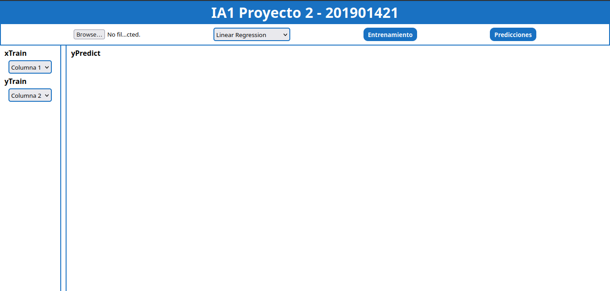
</p>   

### **Componente Principal**  
<p align="center">
  
</p>     
EL componente principal de la app web cuenta con 4 items, que se describen a continuación:  

1. **Selector de archivos**: Permite seleccionar un archivo .csv para utilizar con algunos de los modelos de ML disponibles.  
2. **Selector de modelos**: Permite seleccionar el modelo ML a utilizar en el entrenamiento y en las predicciones. Los modelos disponibles son:  
    1. Regresión lineal.  
    2. Regresión polinomial.  
    3. Red neuronal  
3. **Botón de entrenamiento**: Permite entrenar el modelo de ML seleccionado con los datos cargados del .csv y con los parámetros configurados en la barra lateral.  
4. **Botón de predecir**: Permite realizar predicciones según el tipo de modelo de ML seleccionado, devuelve los valores predecidos y muestra una gráfica si el modelo lo permite.  
  
### **Modelo de Regresión Lineal**  
Para utilizar este modelo de Machine Learning se deben seguir los siguientes pasos:  

1. En este modelo se debe cargar un archivo con extensión .csv, con el siguiente formato:  
<p align="center">
  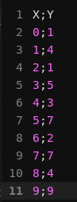
</p>  

2. En la barra lateral es posible configurar los parámetros para el entrenamiento:  
<p align="center">
  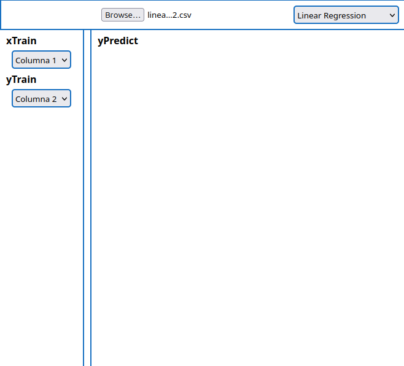
</p>  

3. Dar click en el botón de entrenamiento, cuando el entrenamiento finalice aparecera una ventana que lo indica.  
<p align="center">
  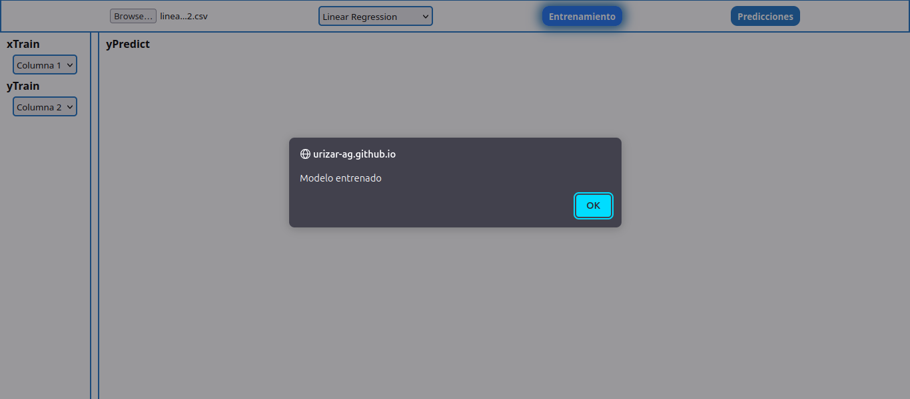
</p>   

4. Por último dar click en el botón de "Predecir" y de forma automática aparecerá el resultado de la predicción y la gráfica que representa dicha predicción.  
<p align="center">
  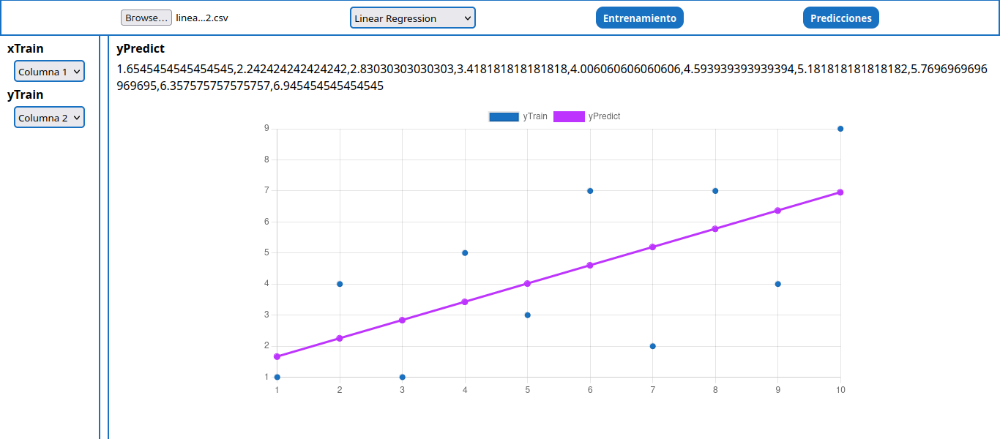
</p>  
  
### **Modelo de Regresión Polinomial**  
Para utilizar este modelo de Machine Learning se deben seguir los siguientes pasos:  

1. En este modelo se debe cargar un archivo con extensión .csv, con el siguiente formato:  
<p align="center">
  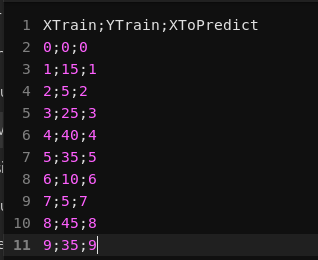
</p>  

2. Seleccionar "Polynomial Regression" en el selector de modelos de ML. En la barra lateral es posible configurar los parámetros para el entrenamiento:  
<p align="center">
  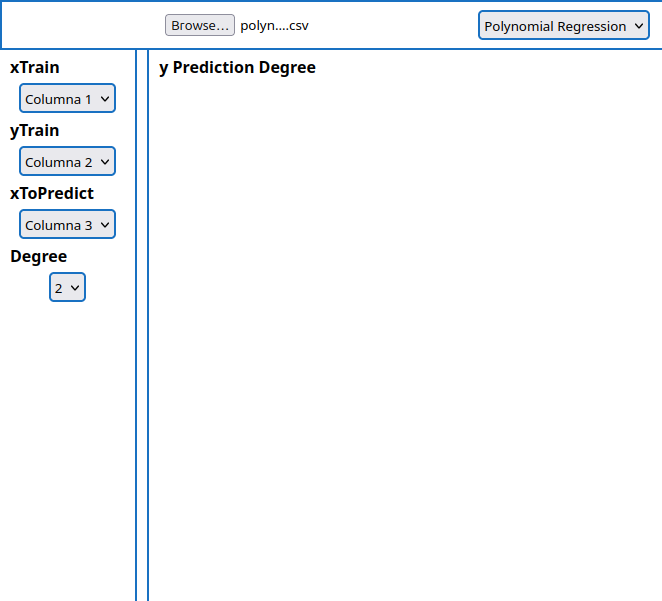
</p>  

3. Dar click en el botón de entrenamiento, cuando el entrenamiento finalice aparecera una ventana que lo indica.  
<p align="center">
  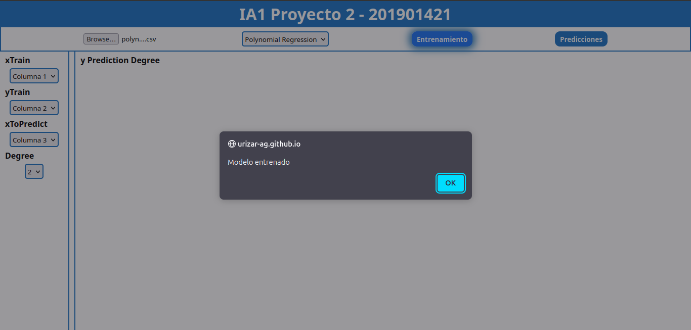
</p>   

4. Por último dar click en el botón de "Predecir" y de forma automática aparecerá el resultado de la predicción y la gráfica que representa dicha predicción.  
<p align="center">
  
</p>  
  
### **Modelo de Red Neuronal**  
Para utilizar este modelo de Machine Learning se deben seguir los siguientes pasos:  

1. Se debe seleccionar "Neuronal Network" en el selector de modelos de ML. En la barra lateral se debe ingresar los números a utilizar por el modelo en el siguiente formato:  
```  
n1 > n2:  
20,10   

n1 < n2:  
10,5  
```  

<p align="center">
  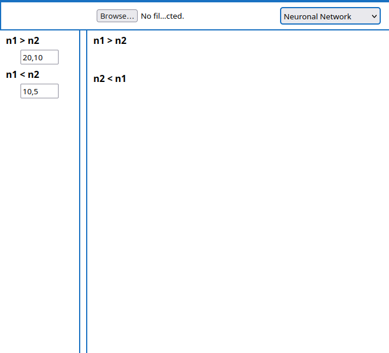
</p>  

3. Dar click en el botón de entrenamiento, cuando el entrenamiento finalice aparecera una ventana que lo indica.  
<p align="center">
  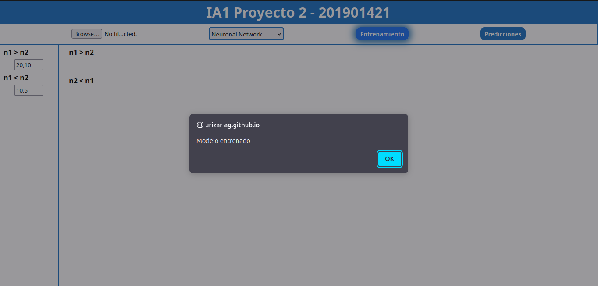
</p>   

4. Por último dar click en el botón de "Predecir" y de forma automática aparecerá el resultado de la predicción y la gráfica que representa dicha predicción.  
<p align="center">
  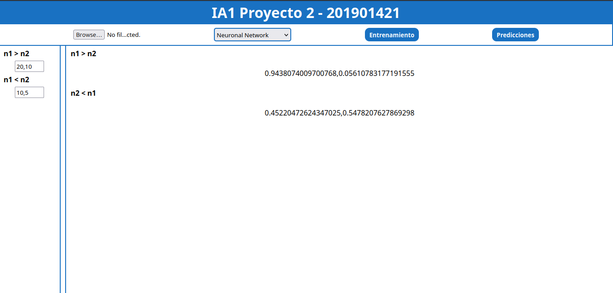
</p>  